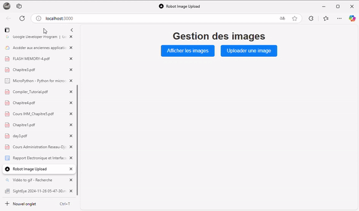

# Projet de gestion d'images avec interface Web et bot Telegram

## Description

Ce projet combine une application Web et un bot Telegram permettant :
- Le téléchargement et la gestion d'images.
- L'interaction avec un robot via des signaux comme *start*, *pause*, *cancel*, *bip*, et *resume*.

L'application Web et le bot Telegram sont synchronisés avec une base de données MySQL nommée **ImageDB** pour stocker et gérer les images.

---

## Arborescence du projet

```
- db/
  - database.sql        
- execution-daemon/
  - config.sh
  - start_daemon.py   
- signal-handler/
  - handler.py        
- Telegram/
  - bot.py                    
- Web/
  - backend/            
  - frontend/           
```

---

## Fonctionnalités principales

### Bot Telegram
- **Upload d'images** : permet d'envoyer des images au bot pour les stocker dans la base de données.
- **Recherche d'images** : affiche une liste d'images disponibles avec leurs dates d'enregistrement.
- **Sélection d'image** : transfert une image choisie pour une gestion ou un traitement ultérieur.
- **Signaux au robot** : permet d'envoyer des commandes au robot, incluant :
  - **start** : démarre une tâche ou une opération du robot.
  - **pause** : met en pause l'opération du robot en cours.
  - **cancel** : annule l'opération en cours.
  - **bip** : envoie un signal au robot pour qu'il émette un bip sonore.
  - **resume** : reprend l'opération en pause.

### Application Web
- **Interface utilisateur moderne et responsive** en ReactJS.
- **Gestion complète des images** : upload, visualisation, et traitement des images.
- **Base de données commune avec le bot Telegram.**

---

## Tutoriels d'utilisation

### Bot Telegram


### Application Web


---

## Prérequis

Avant de commencer, assurez-vous que votre Raspberry Pi est prêt pour le déploiement du projet. Voici les étapes pour installer et configurer l'environnement nécessaire.

### 1. Installer le système d'exploitation sur le Raspberry Pi
- Téléchargez et installez [Raspberry Pi OS](https://www.raspberrypi.org/software/) sur votre Raspberry Pi. Vous pouvez utiliser [Raspberry Pi Imager](https://www.raspberrypi.org/software/) pour une installation rapide sur une carte SD.

---

## Déploiement du projet sur Raspberry Pi

### Étape 1 : Configurer le Raspberry Pi

1. **Mettre à jour le Raspberry Pi** :
   Ouvrez un terminal et exécutez les commandes suivantes pour mettre à jour votre Raspberry Pi :
   ```bash
   sudo apt update
   sudo apt upgrade -y
   ```

2. **Installer Python 3 et pip** :
   Le bot Telegram utilise Python, vous devez donc installer Python 3 et son gestionnaire de paquets `pip` :
   ```bash
   sudo apt install python3 python3-pip -y
   ```

3. **Installer Node.js et npm** :
   Le backend utilise Node.js, donc installez Node.js et npm :
   ```bash
   curl -sL https://deb.nodesource.com/setup_16.x | sudo -E bash -
   sudo apt install -y nodejs
   ```

4. **Installer MySQL** :
   Le projet utilise MySQL pour la gestion de la base de données. Nous n'utiliserons pas de mot de passe pour la connexion :
   ```bash
   sudo apt install mysql-server -y
   sudo systemctl start mysql
   sudo systemctl enable mysql
   ```

   Après l'installation, vous pouvez vous connecter à MySQL sans mot de passe en utilisant :
   ```bash
   sudo mysql
   ```

   Assurez-vous qu'il n'y a pas de mot de passe défini pour l'utilisateur root en exécutant la commande suivante dans MySQL :
   ```sql
   ALTER USER 'root'@'localhost' IDENTIFIED BY '';
   ```

5. **Installer d'autres dépendances pour le projet** :
   Installez les bibliothèques Python nécessaires pour le bot Telegram :
   ```bash
   pip3 install telebot mysql-connector-python requests
   ```

---

### Étape 2 : Configurer la base de données

1. **Créer une base de données MySQL** :
   Connectez-vous à MySQL et créez une nouvelle base de données pour le projet :
   ```bash
   mysql -u root
   CREATE DATABASE ImageDB;
   EXIT;
   ```

2. **Importer le schéma de la base de données** :
   Importez le fichier `database.sql` dans votre base de données :
   ```bash
   mysql -u root ImageDB < db/database.sql
   ```

3. **Mettre à jour les informations de connexion** :
   Mettez à jour les fichiers `bot.py` et le backend avec vos informations de connexion MySQL (nom de la base de données, utilisateur, mot de passe).

---

### Étape 3 : Déployer le bot Telegram

1. **Rendez-vous dans le dossier `Telegram/`** :
   Allez dans le répertoire du bot Telegram et configurez-le en modifiant le fichier `bot.py` avec votre token Telegram et les informations de la base de données.

2. **Lancez le bot** :
   Exécutez le bot Telegram avec la commande suivante :
   ```bash
   python3 bot.py
   ```

---

### Étape 4 : Déployer l'application Web

1. **Lancer le backend** :
   Allez dans le dossier `Web/backend` et démarrez le serveur backend avec la commande :
   ```bash
   node server.js
   ```

2. **Lancer le frontend** :
   Dans un autre terminal, allez dans le dossier `Web/frontend` et lancez le serveur frontend avec la commande :
   ```bash
   npm start
   ```

---

## Fonctionnement des signaux

Voici une explication détaillée de chaque signal que vous pouvez envoyer via le bot Telegram pour interagir avec le robot :

- **start** : Lance une nouvelle opération ou tâche dans le robot. Cela peut inclure des tâches de traitement d'image, de mouvement ou d'autres actions configurées.
- **pause** : Met en pause l'opération en cours. Utile pour suspendre une tâche avant qu'elle ne soit terminée.
- **cancel** : Annule l'opération en cours, interrompant tout traitement ou mouvement.
- **bip** : Envoie un signal au robot pour qu'il émette un bip sonore, utile pour signaler un événement ou une étape.
- **resume** : Reprend une opération en pause, permettant de continuer là où elle s'était arrêtée.

---

## Pour plus d'informations sur le projet, consultez le [README principal](../../README.md).