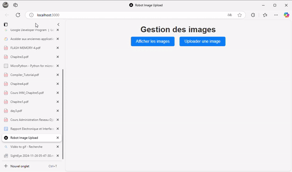

# Projet de gestion d'images avec interface Web et bot Telegram

## Description

Ce projet combine une application Web et un bot Telegram permettant :
- Le téléchargement et la gestion d'images.
- L'interaction avec un robot via des signaux comme *start*, *pause*, *cancel*, *bip*, et *resume*.

L'application Web et le bot Telegram sont synchronisés avec une base de données MySQL nommée **ImageDB** pour stocker et gérer les images.

---

## Arborescence du projet

```
- db/
  - database.sql        
- execution-daemon/
  - config.sh
  - start_daemon.py   
- signal-handler/
  - handler.py        
- Telegram/
  - bot.py                    
- Web/
  - backend/            
  - frontend/           
```

---

## Fonctionnalités principales

### Bot Telegram
- **Upload d'images** : permet d'envoyer des images au bot pour les stocker dans la base de données.
- **Recherche d'images** : affiche une liste d'images disponibles avec leurs dates d'enregistrement.
- **Sélection d'image** : transfert une image choisie pour une gestion ou un traitement ultérieur.
- **Signaux au robot** : permet d'envoyer des commandes au robot, incluant :
  - **start** : démarre une tâche ou une opération du robot.
  - **pause** : met en pause l'opération du robot en cours.
  - **cancel** : annule l'opération en cours.
  - **bip** : envoie un signal au robot pour qu'il émette un bip sonore.
  - **resume** : reprend l'opération en pause.

### Application Web
- **Interface utilisateur moderne et responsive** en ReactJS.
- **Gestion complète des images** : upload, visualisation, et traitement des images.
- **Base de données commune avec le bot Telegram.**

---

## Communication à travers les signaux

### Description de la communication

Les signaux envoyés via le bot Telegram (ou l'application Web) influencent directement un **programme principal** en cours d'exécution sur le Raspberry Pi. Ce programme peut être une boucle principale gérant diverses opérations du robot, telles que des mouvements ou des tâches spécifiques. 

Le gestionnaire de signaux (`handler.py`) agit comme un intermédiaire pour relayer les commandes reçues depuis le bot vers le programme principal. Cela garantit une synchronisation et une influence en temps réel.

#### Exemple de flux de communication
1. **Commande depuis le bot Telegram** : 
   - Un utilisateur envoie un signal, tel que `start`.
   - Le bot enregistre le signal dans la base de données ou l'envoie directement au gestionnaire.

2. **Traitement par le gestionnaire de signaux** :
   - Le gestionnaire interprète le signal reçu et l'envoie au programme principal en cours d'exécution.

3. **Réponse du programme principal** :
   - Le programme principal exécute l'instruction et peut retourner un message de confirmation ou un état d'erreur au gestionnaire.

---

## Fusion du gestionnaire de signaux avec le programme principal

### Objectif

Le but est d'intégrer le gestionnaire de signaux avec le programme principal exécuté sur le Raspberry Pi pour permettre une communication bidirectionnelle. Cela permet de recevoir des commandes en temps réel tout en maintenant le fonctionnement continu du programme principal.

### Étapes pour la fusion

1. **Modifier `handler.py`** :
   - Adaptez le gestionnaire pour inclure une référence au programme principal.
   - Ajoutez des fonctions qui peuvent interagir avec le programme principal (par exemple, démarrer/arrêter des tâches, suspendre des boucles, etc.).

   Exemple de gestion des signaux dans le gestionnaire :
   ```python
   import queue

   # File partagée pour communiquer avec le programme principal
   signal_queue = queue.Queue()

   def handle_signal(signal):
       if signal in ["start", "pause", "cancel", "bip", "resume"]:
           signal_queue.put(signal)
           print(f"Signal '{signal}' transmis au programme principal.")
       else:
           print(f"Signal '{signal}' non reconnu.")
   ```

2. **Intégrer le gestionnaire dans le programme principal** :
   - Importez le gestionnaire de signaux dans le programme principal.
   - Ajoutez une boucle dédiée pour écouter les commandes transmises par le gestionnaire.

   Exemple de programme principal avec intégration :
   ```python
   import time
   from signal_handler import signal_queue

   def main_program():
       print("Programme principal démarré.")
       running = True

       while running:
           # Vérifie si un signal a été envoyé
           if not signal_queue.empty():
               signal = signal_queue.get()

               if signal == "start":
                   print("Démarrage de la tâche...")
                   # Code pour démarrer une tâche
               elif signal == "pause":
                   print("Tâche mise en pause.")
                   # Code pour mettre en pause
               elif signal == "cancel":
                   print("Tâche annulée.")
                   running = False  # Exemple d'arrêt complet
               elif signal == "bip":
                   print("Bip sonore émis.")
                   # Code pour un bip sonore
               elif signal == "resume":
                   print("Reprise de la tâche.")
                   # Code pour reprendre

           time.sleep(0.1)  # Évite une boucle trop rapide

   if __name__ == "__main__":
       main_program()
   ```

3. **Tester la communication** :
   - Lancez le gestionnaire de signaux en arrière-plan.
   - Démarrez le programme principal et envoyez des signaux via le bot Telegram pour vérifier que chaque commande est correctement interprétée.

---

## Tutoriels d'utilisation

### Bot Telegram


### Application Web


---

## Pour plus d'informations

Pour toute question ou problème, consultez la documentation complète ou contactez-nous directement.